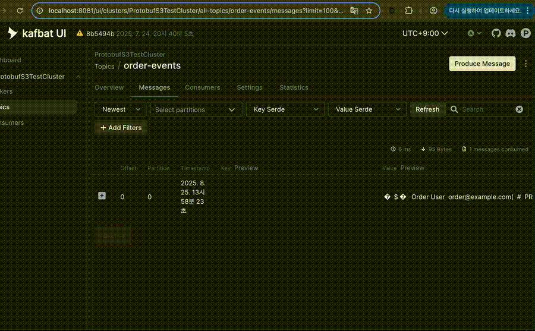

# Protobuf Descriptor Set Serde for Kafbat UI

A custom serializer/deserializer (serde) for [Kafbat UI](https://github.com/kafbat/kafka-ui) that allows deserializing protobuf messages using a protobuf descriptor set file.

## Demo



## Features

- **Protobuf Message Visualization**: Transform binary protobuf messages into readable JSON in Kafbat UI
- **Message Production**: Create protobuf messages from JSON in Kafka UI (full serialization support)
- **Topic-Specific Mapping**: Configure different protobuf message types for different Kafka topics
- **Flexible Storage**: Load descriptors from local files or S3-compatible storage (AWS S3, MinIO)


## Requirements

- **Java 17+** (required by protobuf-java and Kafbat UI Serde API)
- **Kafbat UI >= 1.0.0** (serde-api 1.0.0 support)

## Compatibility Matrix

| Plugin Version | Kafbat UI Version | Serde API Version | Java Version |
|---------------|-------------------|-------------------|--------------|
| 0.1.3+        | >= 1.0.0          | 1.0.0            | 17+          |

**Notes**: 
- This plugin uses `io.kafbat.ui:serde-api:1.0.0` from Maven Central (published February 2024)
- Kafbat UI v1.0.0+ includes the standardized Serde API for custom plugins
- Java 17+ required for both protobuf-java compatibility and Kafbat UI Serde API

## Quick Start

### 1. Generate Descriptor Set

Create a protobuf descriptor set from your .proto files:

```bash
# Using buf (recommended)
buf build -o descriptors.desc

# Using protoc
protoc --descriptor_set_out=descriptors.desc \
       --include_imports \
       your_proto_files.proto
```

**CRITICAL: The `--include_imports` flag is MANDATORY if your .proto files have any imports or dependencies**

### 2. Download the Serde

Download the latest JAR from [Releases](https://github.com/hursungyun/kafka-ui-protobuf-descriptor-set-serde/releases) or build from source.

**Note**: Replace `{VERSION}` in the configuration examples below with the actual version number (e.g., `0.1.3`).

### 3. Configure Kafbat UI

Add the serde to your Kafbat UI configuration:

#### Local File Configuration

```yaml
kafka:
  clusters:
    - name: MyCluster
      serde:
        - name: ProtobufDescriptorSetSerde
          className: io.github.hursungyun.kafbat.ui.serde.ProtobufDescriptorSetSerde
          filePath: /path/to/kafbat-ui-serde-protobuf-descriptor-{VERSION}.jar
          properties:
            descriptor.value.file: /path/to/your/descriptors.desc
            message.value.default.type: "your.package.DefaultMessage"
            topic.mapping.value.local:
              user-events: "your.package.User"
              order-events: "your.package.Order"
```

#### S3 Configuration

```yaml
kafka:
  clusters:
    - name: MyCluster
      serde:
        - name: ProtobufDescriptorSetSerde
          className: io.github.hursungyun.kafbat.ui.serde.ProtobufDescriptorSetSerde
          filePath: /path/to/kafbat-ui-serde-protobuf-descriptor-{VERSION}.jar
          properties:
            # Global S3 Configuration
            s3.endpoint: "https://s3.amazonaws.com"
            s3.region: "us-east-1"
            s3.auth.access.key: "YOUR_ACCESS_KEY"
            s3.auth.secret.key: "YOUR_SECRET_KEY"
            
            # Descriptor Configuration
            descriptor.value.s3.bucket: "my-protobuf-descriptors"
            descriptor.value.s3.object.key: "descriptors/my-app.desc"
            descriptor.value.s3.refresh.interval.seconds: 300
            
            # Message Configuration
            message.value.default.type: "your.package.DefaultMessage"
            
            # Topic Mapping Configuration
            topic.mapping.value.s3.bucket: "my-protobuf-descriptors"
            topic.mapping.value.s3.object.key: "topic-mappings.json"
            topic.mapping.value.local:
              user-events: "your.package.User"
              order-events: "your.package.Order"
```

#### S3 Topic Mapping JSON Format

When using S3 topic mappings, create a JSON file with topic-to-message-type mappings:

```json
{
  "user-events": "your.package.User",
  "order-events": "your.package.Order",
  "payment-events": "your.package.Payment"
}
```

#### S3 with IAM Roles (IRSA)

For AWS environments using IAM roles (like EKS with IRSA), you can omit the access keys:

```yaml
kafka:
  clusters:
    - name: MyCluster
      serde:
        - name: ProtobufDescriptorSetSerde
          className: io.github.hursungyun.kafbat.ui.serde.ProtobufDescriptorSetSerde
          filePath: /path/to/kafbat-ui-serde-protobuf-descriptor-{VERSION}.jar
          properties:
            # Global S3 Configuration using IAM roles (no access keys needed)
            s3.endpoint: "https://s3.ap-northeast-2.amazonaws.com"
            s3.region: "ap-northeast-2"
            s3.auth.sts.endpoint: "https://sts.amazonaws.com"  # Optional: STS endpoint for IRSA
            
            # Descriptor Configuration
            descriptor.value.s3.bucket: "my-protobuf-descriptors"
            descriptor.value.s3.object.key: "descriptors/my-app.desc"
            descriptor.value.s3.refresh.interval.seconds: 6000
            
            # Serialization behavior
            serialization.strict.field.validation: true  # Require all fields in JSON
            
            # Topic mappings from local configuration
            topic.mapping.value.local:
              "my-topic": "my.package.MyMessage"
```

**Note**: Local `topic.mapping.value.local` configuration always overrides S3 topic mappings.

## Serialization Validation

**Strict Mode (Default):** All JSON fields required, prevents data loss  
**Lenient Mode:** Missing fields get defaults, more flexible for development

```yaml
properties:
  serialization.strict.field.validation: true   # Default: strict
  serialization.strict.field.validation: false  # Optional: lenient
```

## Configuration Properties

### Required Properties

**Either local file OR S3 configuration must be provided. S3 takes precedence if both are specified.**

| Property | Description |
|----------|-------------|
| `descriptor.value.file` | Path to local protobuf descriptor set file |
| `s3.endpoint` | S3 endpoint URL (e.g., https://s3.amazonaws.com) |
| `descriptor.value.s3.bucket` | S3 bucket name containing the descriptor set |
| `descriptor.value.s3.object.key` | S3 object key (path) to the descriptor set file |
| `s3.auth.access.key` | S3 access key (optional - uses IAM roles if not provided) |
| `s3.auth.secret.key` | S3 secret key (optional - uses IAM roles if not provided) |
| `s3.auth.sts.endpoint` | STS endpoint for IRSA (default: https://sts.amazonaws.com) |

### Optional Properties

| Property | Default | Description |
|----------|---------|-------------|
| `message.value.default.type` | - | Default message type for all topics |
| `topic.mapping.value.local.*` | - | Topic-specific message type mapping (overrides S3 config) |
| `topic.mapping.value.s3.bucket` | - | S3 bucket containing topic mapping JSON file |
| `topic.mapping.value.s3.object.key` | - | S3 object key for topic mapping JSON file |
| `serialization.strict.field.validation` | `true` | Require all protobuf fields in JSON (false = allow missing fields) |
| `s3.region` | - | S3 region (if required by your provider) |
| `s3.secure` | `true` | Use HTTPS (set to false for HTTP endpoints) |
| `descriptor.value.s3.refresh.interval.seconds` | `300` | How often to check for descriptor updates |

## Support

- **Documentation**: See [CONTRIBUTING.md](CONTRIBUTING.md) for development setup
- **Issues**: Report problems on [GitHub Issues](https://github.com/hursungyun/kafka-ui-protobuf-descriptor-set-serde/issues)
- **Features**: Request new features via GitHub Issues
- **Questions**: Check existing issues or create a new one

## License

This project is licensed under the MIT License - see the LICENSE file for details.
