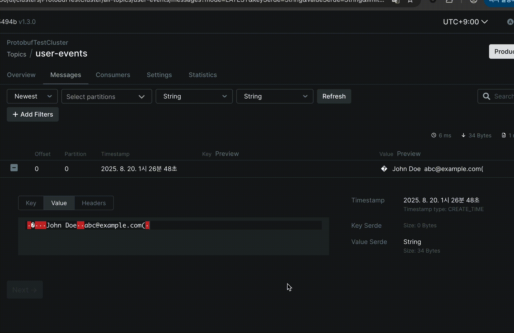

# Protobuf Descriptor Set Serde for Kafbat UI

A custom serializer/deserializer (serde) for [Kafbat UI](https://github.com/kafbat/kafka-ui) that allows deserializing protobuf messages using a protobuf descriptor set file.

## Demo



## Features

- **🔍 Protobuf Message Visualization**: Transform binary protobuf messages into readable JSON in Kafbat UI
- **📋 Descriptor Set Support**: Use compiled protobuf descriptor sets (`.desc` files) for schema definitions
- **🎯 Topic-Specific Mapping**: Configure different protobuf message types for different Kafka topics
- **📁 Flexible Storage**: Load descriptors from local files or S3-compatible storage (AWS S3, MinIO)

## Quick Start

### 1. Generate Descriptor Set

Create a protobuf descriptor set from your .proto files:

```bash
# Using buf (recommended)
buf build -o descriptors.desc

# Using protoc
protoc --descriptor_set_out=descriptors.desc \
       --include_imports \
       your_proto_files.proto
```

**🚨 CRITICAL: The `--include_imports` flag is MANDATORY if your .proto files have any imports or dependencies**

### 2. Download the Serde

Download the latest JAR from [Releases](https://github.com/hursungyun/kafka-ui-protobuf-descriptor-set-serde/releases) or build from source.

### 3. Configure Kafbat UI

Add the serde to your Kafbat UI configuration:

#### Local File Configuration

```yaml
kafka:
  clusters:
    - name: MyCluster
      serde:
        - name: ProtobufDescriptorSetSerde
          className: io.github.hursungyun.kafbat.ui.serde.ProtobufDescriptorSetSerde
          filePath: /path/to/kafbat-ui-serde-protobuf-descriptor-1.0.0.jar
          properties:
            protobuf.descriptor.set.file: /path/to/your/descriptors.desc
            protobuf.message.name: "your.package.DefaultMessage"
            protobuf.topic.message.map:
              user-events: "your.package.User"
              order-events: "your.package.Order"
```

#### S3 Configuration

```yaml
kafka:
  clusters:
    - name: MyCluster
      serde:
        - name: ProtobufDescriptorSetSerde
          className: io.github.hursungyun.kafbat.ui.serde.ProtobufDescriptorSetSerde
          filePath: /path/to/kafbat-ui-serde-protobuf-descriptor-1.0.0.jar
          properties:
            # S3 Configuration
            protobuf.s3.endpoint: "https://s3.amazonaws.com"
            protobuf.s3.bucket: "my-protobuf-descriptors"
            protobuf.s3.object.key: "descriptors/my-app.desc"
            protobuf.s3.access.key: "YOUR_ACCESS_KEY"
            protobuf.s3.secret.key: "YOUR_SECRET_KEY"
            protobuf.s3.region: "us-east-1"
            protobuf.s3.refresh.interval.seconds: 300
            
            # Message Configuration
            protobuf.message.name: "your.package.DefaultMessage"
            
            # S3 Topic Mapping (optional)
            protobuf.topic.message.map.s3.bucket: "my-protobuf-descriptors"
            protobuf.topic.message.map.s3.object.key: "topic-mappings.json"
            
            # Local Topic Mapping (overrides S3 config)
            protobuf.topic.message.map:
              user-events: "your.package.User"
              order-events: "your.package.Order"
```

#### S3 Topic Mapping JSON Format

When using S3 topic mappings, create a JSON file with topic-to-message-type mappings:

```json
{
  "user-events": "your.package.User",
  "order-events": "your.package.Order",
  "payment-events": "your.package.Payment"
}
```

**Note**: Local `protobuf.topic.message.map` configuration always overrides S3 topic mappings.

## Configuration Properties

### Required Properties

**Either local file OR S3 configuration must be provided. S3 takes precedence if both are specified.**

| Property | Description |
|----------|-------------|
| `protobuf.descriptor.set.file` | Path to local protobuf descriptor set file |
| `protobuf.s3.endpoint` | S3 endpoint URL (e.g., https://s3.amazonaws.com) |
| `protobuf.s3.bucket` | S3 bucket name containing the descriptor set |
| `protobuf.s3.object.key` | S3 object key (path) to the descriptor set file |
| `protobuf.s3.access.key` | S3 access key |
| `protobuf.s3.secret.key` | S3 secret key |

### Optional Properties

| Property | Default | Description |
|----------|---------|-------------|
| `protobuf.message.name` | - | Default message type for all topics |
| `protobuf.topic.message.map.*` | - | Topic-specific message type mapping (overrides S3 config) |
| `protobuf.topic.message.map.s3.bucket` | - | S3 bucket containing topic mapping JSON file |
| `protobuf.topic.message.map.s3.object.key` | - | S3 object key for topic mapping JSON file |
| `protobuf.s3.region` | - | S3 region (if required by your provider) |
| `protobuf.s3.secure` | `true` | Use HTTPS (set to false for HTTP endpoints) |
| `protobuf.s3.refresh.interval.seconds` | `300` | How often to check for descriptor updates |

## Support

- **📚 Documentation**: See [CONTRIBUTING.md](CONTRIBUTING.md) for development setup
- **🐛 Issues**: Report problems on [GitHub Issues](https://github.com/hursungyun/kafka-ui-protobuf-descriptor-set-serde/issues)
- **💡 Features**: Request new features via GitHub Issues
- **❓ Questions**: Check existing issues or create a new one

## License

This project is licensed under the MIT License - see the LICENSE file for details.